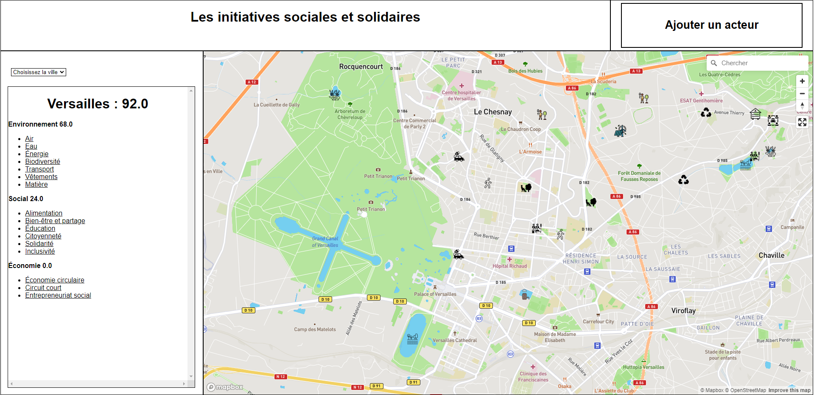

# **Carte MerciMax**

## **Description du projet**
Le projet consiste en la mise en place d'une plateforme web qui référence les initiatives solidaires, les "bonnes actions" sur une carte interactive et collaborative. La solidarité et le lien social sont en effet au coeur de l'entreprise MerciMax. Le périmètre du projet s'est finalement étendu pour prendre en compte le développement durable et ses trois piliers : cette plateforme a ainsi pour objectif de référencer les initiatives sociales, environnementales ou économiques d'une ville sur une carte.
 
Un dispositif de scoring est également mis en place pour attribuer à chaque ville un score qui prend en compte les aspects du développement durable. Chacun de ces trois aspects est divisé en plusieurs sous-thèmes et les différentes initiatives sont alors affectées de coefficients détaillés ci-dessous et qui permettent de calculer le score de la ville.
 
**Les initiatives environnementales :**
 
| Initiative | Thème | Coefficient |
| ------ | ------ | ------ |
| Zone piétonne | Air | 1.0 |
| Marre | Eau | 0.1 |
| Lac | Eau | 1.0 |
| Système de récupération d'eau de pluie | Eau | 0.2 |
| Zone de jachère | Biodiversité | 0.5 |
| Voiture électrique | Energie | 0.1 |
| Arboretum | Biodiversité | 1.0 |
| Ruche | Biodiversité | 0.2 |
| Energie renouvelable | Energie | 0.5 |
| Parc public | Biodiversité | 0.9 |
| Refuge pour animaux | Biodiversité | 0.6 |
| Zone reboisée | Biodiversité | 0.4 |
| Covoiture | Transport | 0.6 |
| Friperie | Vêtements | 0.5 |
| Recyclerie | Matière | 0.6 |
 
**Les initiatives sociales :**
 
| Initiative | Thème | Coefficient |
| ------ | ------ | ------ |
| AMAP | Alimentation | 0.8 |
| Resto du coeur | Alimentation | 0.8 |
| Epicerie locale | Alimentation | 0.6 |
| Ferme bio | Alimentation | 0.7 |
| Ferme | Alimentation | 0.5 |
| Marché hebdomadaire | Alimentation | 0.9 |
| Parc public | Bien-être et partage | 0.4 |
| Salle des fêtes | Bien-être et partage | 0.8 |
| Complexe sportif | Bien-être et partage | 0.9 |
| Zone piétonne | Bien-être et partage | 1.0 |
| Bibliothèque publique | Education | 1.0 |
| Potager collaboratif | Citoyenneté | 0.2 |
| Resto du coeur | Solidarité | 0.8 |
| Boîte à livre | Solidarité | 0.1 |
| Boîte à don | Solidarité | 0.1 |
| Accès PMR | Inclusivité | 0.5 |
 
**Les initiatives économiques :**

| Initiative | Thème | Coefficient |
| ------ | ------ | ------ |
| Monnaie locale | Economie circulaire | 0.7 |
| AMAP | Circuit court | 0.8 |
| Epicerie locale | Circuit court | 0.6 |
| Ferme bio | Circuit court | 0.7 |
| Ferme | Circuit court | 0.5 |
| Marché hebdomadaire | Circuit court | 0.9 |
| Entreprise sociale | Entrepreneuriat social | 1.0 |


L'interface web est fait en HTML, CSS et JavaScript. On utilise Mapbox (surcouche d'OpenStreetMap) pour afficher la carte.
Le serveur back utilise le framework python Flask.
 
Une maquette de la plateforme web nous a été fournie par notre porteur de projet Nicolas et est disponible ici : https://xd.adobe.com/view/b0079d9c-c046-467c-8de5-469f5fb330c8-e554/.


***

## **Installations**
Prérequis : Python et ses bibliothèques flask, sqlite3, urllib avec les instructions `pip install flask`, `pip install urllib` et `pip install sqlite3`.

Pour utiliser ce projet, il faut tout d'abord télécharger le dossier. Pour cela,
 - [ ] utiliser la fonctionnalité de téléchargement de gitlab puis décompresser le fichier vers l'emplacement voulu.
 - [ ] OU démarrer un terminal, se placer dans le dossier voulu, puis exécuter :
 ```
git clone https://gitlab-student.centralesupelec.fr/mael.jeannot/mercimax.git
```
Ensuite, exécuter le fichier app.py, dans un éditeur de code dans un terminal avec la commande suivante, après s'être placé dans le bon dossier :
 ```
python app.py
```

Le serveur web est alors lancé. On peut maintenant s'y connecter localement sur un navigateur à l'adresse choisie, par défault http://127.0.0.1:5000/. Pour s'y connecter depuis un appareil distant, il faudra configurer le pare-feu.

## **Fonctionnement du site**
Le site se présente comme cela :



On peut voir à gauche le score de la ville actuellement choisie. Par défault, Versailles.
On peut changer le choix de la ville grâce au menu déroulant.
Sur la carte, en plus des éléments affichés par OpenStreetMap, sont affichés les acteurs locaux ayant un impact positif au niveau social, environnemental ou économique qui sont présents dans la base de données pour l'instant.
On peut ajouter un acteur à l'aide du bouton en haut à droite. On demande de choisir l'emplacement, le titre, la description et l'icône correspondante.

## **Statut du projet**
En développement

## **Organisation du dossier**

Le serveur tourne sur le fichier app.py.  
La base de données contient les informations importantes, en particulier toutes les informations concernant les marqueurs.  
Dans le dossier templates se trouvent les fichiers html renvoyés lors d'une requête utilisateur. Ils sont eux-mêmes reliés aux fichiers javascript et css des sous-dossiers js et css du dossier static.

Plus particulièrement, lors d'une requête utilisateur GET, le serveur récupère les données de la base et les ajoute dans le fichier index.html avant de le renvoyer.  
Lors d'une requête POST, il récupère la zone actuellement affichée chez l'utilisateur, intègre le marqueur à ajouter dans la base de donnée, puis met à jour le score de la zone correspondante.

Attention, le marqueur est donc associé à la zone qui était sélectionnée quel que soit le lieu où il est placé.  
Attention le score n'est pas mis à jour lors de modifications administrateur de la base de données (uniquement lors de requêtes utilisateur).

Pour ajouter de nouvelles icônes disponibles pour les marqueurs, il faut les ajouter dans le dossier icon_folder ET mettre à jour la base de données afin de faire correspondre des coefficients de score à cette icône.

## **Organisation de la base de données**
Dans la base de données mercimax.db se trouvent quatre tables :
- initiative : elle référence les différentes initiatives en leur donnant un id, un nom, un thème et un coefficient
- markers : elle référence les différents marqueurs de la carte en leur associant une description, un nom d'icone, des coordonnées (latitude et longitude), l'id de la zone dans laquelle il se trouve et son statut (utile lorsqu'il faudra implémenter les différents états des marqueurs : par exemple "validé" et "en cours de validation")
- sqlite_sequence : elle indique le nombre de marqueurs et le nombre de zones sur la carte
- zones : elle contient les informations de chaque zone en leur associatiant un id, un nom, le score pour chaque pilier du développement durable, le score total, ses coordonnées géographiques (latitude et longitude) et le niveau de zoom pour lequel la zone est affichée sur la carte

## **Roadmap**

***Améliorations mineures:***
 - [ ] Choix des icônes lors de l'ajout d'un marqueur par simple clic
 - [ ] Ajout de nouveaux marqueurs possibles (icônes et coefficients de score)
 - [ ] Légère couche de couleur sur les villes en fonction de leur score

***Améliorations majeures:***
 - [ ] Amélioration globale du design
 - [ ] Choix de la zone par clic sur la carte
 - [ ] Envoi du serveur uniquement des marqueurs qui sont dans la zone actuellement affichée chez l'utilisateur et non plus de l'ensemble des marqueurs
 - [ ] Vérification de la validité des requêtes utilisateur avant de les exécuter
 - [ ] Mise en place d'un système d'authentification

## **Auteurs**

Porteur de projet, à contacter pour toute question concernant les ambitions du projet, la direction à prendre, la suite du développement:
- Nicolas de Cerner, nicolas@mercimax.fr

Ont participé au développement du projet:
- Augustin Cobena augustin.cobena@student-cs.fr
- Bastien Maury bastien.maury@student-cs.fr
- Arij Ben Rhouma arij.benrhouma@student-cs.fr
- Martin Mollicone martin.mollicone@student-cs.fr
- Maël Jeannot mael.jeannot@student-cs.fr
- Christian Maréchal cmarchal@aol.com

